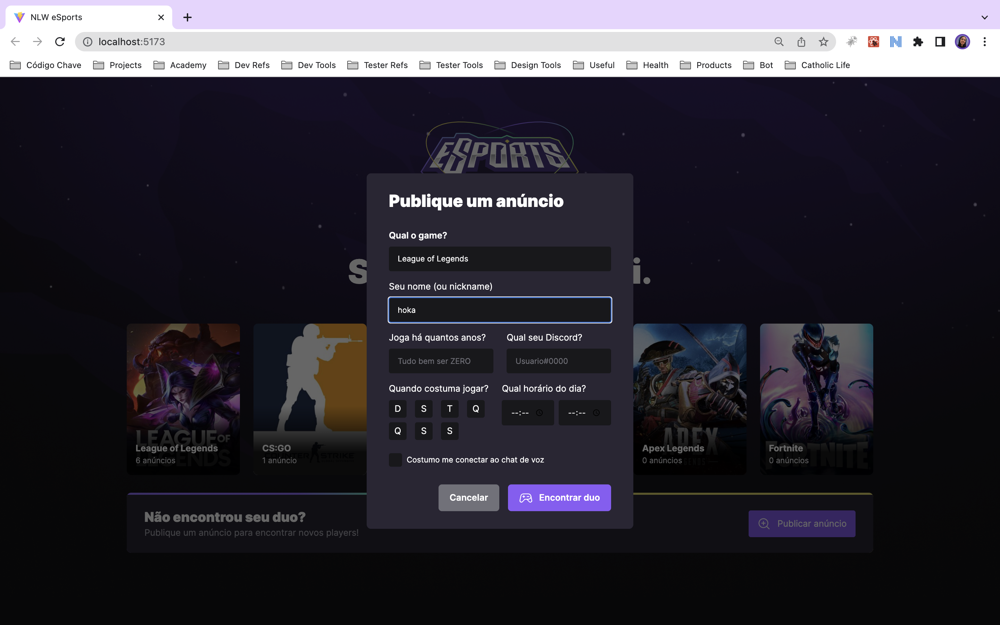

# Find your duo web

This project was developed during the NLW Bootcamp by Rocketseat. The project is a web application that allows you to find a duo to play your favorite games. The project is divided into two repositories, the [server](https://github.com/gihoekveld/find-your-duo-server), the [web](https://github.com/gihoekveld/find-your-duo-web) and the [mobile](https://github.com/gihoekveld/find-your-duo-mobile).

## Technologies used ☕️ 🐍

- ReactJS
- Typescript
- TailwindCSS
- Axios
- Radix UI
- Phosphor React Icons

## Features 🚀

- List games
- Create ads by game

## Screenshots 📸

### Home


### Create Ad


## Installation 💻

Clone the repository

```bash
git clone
cd find-your-duo-web
npm install
```

## Usage 📖

```bash
npm run dev
```